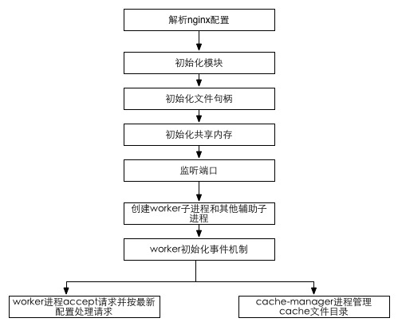

#nginx源码分析

###概述
nginx是一个开源的高性能Web服务器系统，事件驱动、多进程、异步非阻塞、模块化是其主要的特性。源代码层面，有很多自造的“轮子”，作者自己实现了诸如内存池、缓冲区、字符串、链表、红黑树等经典数据结构。全部代码仅有10万行。代码之间耦合的很厉害，很难抽出其中的一部分单独来看。

### 架构设计
nginx启动后，会有一个master进程和多个worker进程。master进程主要用来管理worker进程，包含：接受来自己外界的信号，向各个worker进程发送信号，监控worker进程的运行状态，自动重新启动新的worker进程。基本的网络事件则由worker进程处理。多个worker进程之间是对等的，共同竞争来自客户端的请求，一个请求只能在一个worker进程中处理。worker进程的数量是可以设置的，一般会设置与机器cpu核数一致。

master与worker间的通信通过socketpair来实现。

架构特点可以概括为：
* 非阻塞
* 异步IO
* 事件驱动
* 单线程IO复用
* 一个主线程和少量工作线程
* 高度模块化

* nginx的基本架构

* nginx的进程模型

* 事件模型  

	* 网络事件： 异步非阻塞，处理网络事件的回调函数时，通常的第一个事情即判断超时，然后再去处理网络事件
	* 信号
	* 定时器： epoll_wait函数的超时时间设置，定时器时间放在红黑树中

### 目录结构
	
* auto
  
  检查编译器版本、检查操作系统版本、检查标准库版本、检查模块依赖情况、安装、初始化、多线程检查  
  configure为此目录下的总驱动，调用脚本生成：
  * 版本信息头文件: ngx_auto_config.h ngx_auto_headers.h
  * 默认被包含的模块的声明代码: objs/ngx_modules.c
  * Makefile文件 	

* src 

  源码存放目录
  * core: 主干部分、基础数据结构和基础设施的源码
  * event:事件驱动模型和相关模块的源码
  * http:http server相关代码
  * mail:邮件代理和相关模块
  * misc: C++兼容性测试和google perftools模块
  * os: 依赖于操作系统实现的源码，master和worker创建 
  
* conf

  nginx相关的配置文件
  
### 基础设施

* 内存池：ngx_pool_data_t

* 进程结构：

		struct {
			ngx_pid_t pid
		}ngx_process_t
		
* 连接

ngx_connecttion_t是nginx对连接的封装。这里nginx对连接数的限制与系统的nofile没有直接关系。

worker_connections：每个进程可使用的连接数最大值。

connection_pool连接池：每个worker进程都有一个，其保存的并不是真实的连接。

free_connections保存的是所有的空闲ngx_connection_t

一个nginx所能建立的最大连接数：worker_connections * worker_processes,对于反向代理则需要/2。

### 基本数据结构 

nginx实现中有很多结构体，一般命名为ngx_XXX_t。这些结构体分散在许多头文件中。src/core/ngx_core.h中把几乎所有的头文件都集合起来。也因此造成了nginx各部分源代码的耦合。但实际上nginx各个部分逻辑划分还是很明确的，整体上是一种松散的结构。

* ngx_str_t

		typedef struct{
			size_t len;
			u_char *data;
		}ngx_str_t;
		
这是nginx对字符串的实现，源码在ngx_string.h中。len指的是字符串的长度（不包括\0），data指向字符串。这种设计一方面，在计算字符创长度时只需要读取len字段即可，另一方面可以重复引用一段字符串内存。

常用api:
	
		#define ngx_string(str) { sizof(str) - 1},(u_char *) str } //从一个普通字符串构造出一个nginx字符串，用sizeof计算长度，故参数必须是一个常量字符串。

		#define ngx_null_string {0,NULL}
		
		ngx_strncmp(s1,s2,n)
		
		ngx_strcm(s1,s2)
		 
* ngx_pool_t

		struct ngx_pool_s {
    		ngx_pool_data_t       d;
    		size_t                max;
    		ngx_pool_t           *current;
    		ngx_chain_t          *chain;
    		ngx_pool_large_t     *large;
    		ngx_pool_cleanup_t   *cleanup;
    		ngx_log_t            *log;
		};

这个数据结构在nginx中是一个非常重要的数据结构。用来管理一系列的资源（如内存、文件等
，使得对这些资源的使用和释放统一进行。这个是在c语言编程中值得借鉴的一个东西，代码中如果到处都是malloc和free的话，不仅会导致内存泄露，也会使代码难以阅读和维护。
		
* ngx_array_t

		struct ngx_array_s {
    		void        *elts; //指向实际的存储区域
    		ngx_uint_t   nelts; //数组实际元素个数
    		size_t       size; //数组单个元素的大小，单位是字节
    		ngx_uint_t   nalloc; //数组的容量
    		ngx_pool_t  *pool; //该数组用来分配内存的内存池
		};
	
* ngx_hash_t
	* ngx_hash_t不像其他的hash表的实现，可以插入删除元素，只能一次初始化。
	* 解决冲突使用的是开链法，但实际上是开了一段连续的存储空间，和数组差不多。
   			
			ngx_int_t ngx_hash_init(ngx_hash_init_t *hinit, ngx_hash_key_t *names,ngx_uint_t nelts);//ngx_hash_t的初始化。
			
	
			ngx_hash_init_t提供了初始化一个hash表所需要的一些基本信息
			typedef struct {
    			ngx_hash_t       *hash; //指向hash表
    			ngx_hash_key_pt   key; //指向从字符串生成hash值的hash函数。默认的实现为ngx_hash_key_lc
    			ngx_uint_t        max_size; //hash表中的桶的个数
    			ngx_uint_t        bucket_size; //每个桶的最大限制大小，单位是字节
    			char             *name; //hash表的名字
    			ngx_pool_t       *pool; //hash表分配内存使用的pool
    			ngx_pool_t       *temp_pool; //使用的临时pool,初始化完成后，可以释放和销毁
			} ngx_hash_init_t;
			
			typedef struct {
    			ngx_str_t         key;
    			ngx_uint_t        key_hash;
    			void             *value;
			} ngx_hash_key_t;

			void *ngx_hash_find(ngx_hash_t *hash, ngx_uint_t key, u_char *name, size_t len); //在hash里面查找key对应的value。			
			
* ngx_chain_t
			
nginx的filter模块在处理从别的filter模块或者是handler模块传递过来的数据，数据一个链表的形式（ngx_chain_t）进行传递。
			
			struct ngx_chain_s {
    			ngx_buf_t    *buf;
    			ngx_chain_t  *next;
			};
			
创建ngx_chain_t对象

			ngx_chain_t *ngx_alloc_chain_link(ngx_pool_t *pool);
			
释放一个ngx_chain_t类型的对象。如果要释放整个chain，则迭代此链表，对每个节点使用此宏即可。

			#define ngx_free_chain(pool, cl)                                             \
    cl->next = pool->chain;                                                  \
			pool->chain = cl	
			
对ngx_chaint_t类型的释放，并不是真的释放了内存，而仅仅是把这个对象挂在了这个pool对象的一个叫做chain的字段对应的chain上，以供下次从这个pool上分配ngx_chain_t类型对象的时候，快速的从这个pool->chain上取下链首元素就返回了，当然，如果这个链是空的，才会真的在这个pool上使用ngx_palloc函数进行分配。
		
* ngx_buf_t

ngx_buf_t是ngx_chain_t的数据结点

		struct ngx_buf_s {
    		u_char          *pos;
    		u_char          *last;
    		off_t            file_pos;
    		off_t            file_last;

    		u_char          *start;         /* start of buffer */
    		u_char          *end;           /* end of buffer */
    		ngx_buf_tag_t    tag;
    		ngx_file_t      *file;
    		ngx_buf_t       *shadow;

    		/* the buf's content could be changed */
    		unsigned         temporary:1;

    		/*
     		* the buf's content is in a memory cache or in a read only memory
     		* and must not be changed
     		*/
    		unsigned         memory:1;

    		/* the buf's content is mmap()ed and must not be changed */
    		unsigned         mmap:1;

    		unsigned         recycled:1;
    		unsigned         in_file:1;
   			unsigned         flush:1;
    		unsigned         sync:1;
    		unsigned         last_buf:1;
    		unsigned         last_in_chain:1;

    		unsigned         last_shadow:1;
    		unsigned         temp_file:1;

    		/* STUB */ int   num;
		};
		
* ngx_list_t

和普通的链表实现相比，它的节点是一个固定大小的数组。在初始化的时候，我们需要设定元素需要占用的空间大小，每个节点数组的容量大小。在添加元素到这个list里面的时候，会在最尾部的节点里的数组上添加元素，如果这个节点的数组存满了，就再增加一个新的节点到这个list里面去。

		typedef struct {
    		ngx_list_part_t  *last; //指向该链表的最后一个节点
    		ngx_list_part_t   part; //指向该链表首个存放具体元素的节点
    		size_t            size; //链表中存放的具体元素所需内存大小
    		ngx_uint_t        nalloc; //每个节点所含的固定大小的数组的容量
    		ngx_pool_t       *pool; //该list使用的分配内存的pool
		} ngx_list_t;
		
		struct ngx_list_part_s {
    		void             *elts; //节点中存放具体元素的内存的开始地址   
    		ngx_uint_t        nelts; //节点中已有元素个数，不能大于 nalloc
    		ngx_list_part_t  *next; //指向下一个节点
		};
		
		ngx_list_t *ngx_list_create(ngx_pool_t *pool, ngx_uint_t n, size_t size); //创建一个ngx_list_t类型的对象,并对该list的第一个节点分配存放元素的内存空间。

		pool:	分配内存使用的pool。
		n:	每个节点固定长度的数组的长度。
		size:	存放的具体元素的个数。
		
* ngx_queue_t 
		
		struct ngx_queue_s {
    		ngx_queue_t  *prev;
    		ngx_queue_t  *next;
		};
		
链表节点的数据成员并没有生命在链表节点的结构体中，只是声明了前向和后向指针。使用的时候需要定义一个哨兵节点。具体存放数据的节点称之为数据节点。对于数据节点，需要在数据结构体中加入一个类型为ngx_queue_s的域。使用下面的函数进行数据插入，其中x为数据节点的queue_t域。
		
		#define ngx_queue_insert_head(h, x)                         \
    		(x)->next = (h)->next;                                  \
    		(x)->next->prev = x;                                    \
    		(x)->prev = h;                                          \
    		(h)->next = x

		#define ngx_queue_insert_after   ngx_queue_insert_head

		#define ngx_queue_insert_tail(h, x)                          \
    		(x)->prev = (h)->prev;                                   \
    		(x)->prev->next = x;                                     \
    		(x)->next = h;                                           \
    		(h)->prev = x
    	获得数据时，使用ngx_queue_data()宏。
    	#define ngx_queue_data(q, type, link)                        \
    		(type *) ((u_char *) q - offsetof(type, link))    		
### 配置系统

一个主配置文件+其他辅助的配置文件，nginx/conf。主配置文件nginx.conf包含若干配置项，每个配置项由配置指令和指令参数2各部分构成。  

指令上下文：

* main: 运行时与具体业务无关的一些参数。

	* user
	* worker_processes
	* error_log
	* events
	* http
	* mail

* http: 与提供http服务相关的一些配置参数。

	* server

* server：http服务支持若干虚拟主机。每个虚拟主机一个对应的Server配置。

	* listen
	* server_name
	* access_log
	* location
	* protocol
	* proxy
	* smtp_auth
	* xclient 

* location：http服务中，某些特定的url对应的一系列配置项。

	* index
	* root

* mail：实现Email相关的smtp/imap/pop3代理时，共享的一些配置项。

	* server
	* auth_http
	* imap_capabilities
	

### 模块化

nginx的内部结构是由核心部分和一系列的功能模块所组成的。其中核心除了web服务器的基础功能外，还包括web服务反向代理、email服务反向代理等功能。同时，nginx core实现了底层的通讯协议，为其他模块和nginx进程构建了基本的运行时环境，构建了高其他各模块的协作基础。

nginx是高度模块化的，除了核心部分的相关功能都是在其他模块中实现的。nginx将各个功能模块组织成一条链，当有请求到达时，请求依次经过这条链上的部分或者全部模块进行处理。其中，每个模块实现特定的功能。http以及mail模块位于nginx core和各功能模块的中间。

nginx中的模块可以分为以下几种类型：

* event module: 搭建了独立于操作系统的事件处理机制的框架，以及提供了各具体事件的处理。
* phase handler: 即handler模块，负责处理客户端请求并产生待响应内容。
* output filter: filter模块，负责对输出的内容进行处理，可以对输出进行修改。
* upstream： 反向代理的功能，是一种特殊的handler，响应内容由后端服务器产生。
* load-balance：负载均衡模块。 

一个典型的模块有以下几部分组成：
		
* 一个结构体：
		
		typedef struct {
    		ngx_str_t output_words;
		} ngx_http_hello_world_loc_conf_t;

* 三个变量

		// Structure for the HelloWorld command
		static ngx_command_t ngx_http_hello_world_commands[] = {
    	{
        	ngx_string("hello_world"), // The command name
        	NGX_HTTP_LOC_CONF | NGX_CONF_TAKE1,
        	ngx_http_hello_world, // The command handler
        	NGX_HTTP_LOC_CONF_OFFSET,
        	offsetof(ngx_http_hello_world_loc_conf_t, output_words),
        	NULL
    	},
    	ngx_null_command
		};

		// Structure for the HelloWorld context
		static ngx_http_module_t ngx_http_hello_world_module_ctx = {
    		NULL,
    		NULL,
    		NULL,
    		NULL,
    		NULL,
    		NULL,
    		ngx_http_hello_world_create_loc_conf,
    		ngx_http_hello_world_merge_loc_conf
		};

		// Structure for the HelloWorld module, the most important thing
		ngx_module_t ngx_http_hello_world_module = {
    		NGX_MODULE_V1,
    		&ngx_http_hello_world_module_ctx,
    		ngx_http_hello_world_commands,
    		NGX_HTTP_MODULE,
    		NULL,
    		NULL,
    		NULL,
    		NULL,
    		NULL,
    		NULL,
    		NULL,
    		NGX_MODULE_V1_PADDING
		};

* 三个函数

		static char* ngx_http_hello_world(ngx_conf_t* cf, ngx_command_t* cmd, void* conf);
		static void* ngx_http_hello_world_create_loc_conf(ngx_conf_t* cf)
		static char* ngx_http_hello_world_merge_loc_conf(ngx_conf_t* cf, void* parent, void* child)

模块的加载与运行流程：

1. preconfiguration:初始化http组件和nginx其他组件的交互
2. 解析配置文件：解析配置文件中国的http模块（server location）创建main_conf srv_conf loc_conf
3. 初始化http组件的main部分
4. 合并配置
5. postConfiguration

### 请求处理

worker进程中，ngx_worker_process_cycle()是一个无线循环的处理函数。一个简单处理请求流程如下：

1. 操作系统提供的机制产生相关的事件。
2. 接收和处理这些事件，如果接收到数据，则产生更高层的request对象。
3. 处理request的header和body.
4. 产生响应，并发送回客户端；
5. 产生request的处理
6. 重新初始化定时器以及其他事件

Http Request处理过程：

1. 读取客户端数据，生成Http Request对象（ngx_http_request_t），该对象包含多有请求信息
2. 处理请求头→处理请求体
3. 如果有的话，调用与此请求（URL或者Location关联的handler）
4. 依次调用个phase handler进行处理

一个phase handler通常执行以下任务：

1. 获取Location配置ng
2. 产生适当的响应
3. 发送response header
4. 发送response body

一般情况下经过的phase handler:

* NGX_HTTP_POST_READ_PHASE:
 	读取请求内容阶段
* NGX_HTTP_SERVER_REWRITE_PHASE:
 	Server请求地址重写阶段
* NGX_HTTP_FIND_CONFIG_PHASE:
 	配置查找阶段:
* NGX_HTTP_REWRITE_PHASE:
 	Location请求地址重写阶段
* NGX_HTTP_POST_REWRITE_PHASE:
 	请求地址重写提交阶段
* NGX_HTTP_PREACCESS_PHASE:
 	访问权限检查准备阶段
* NGX_HTTP_ACCESS_PHASE:
 	访问权限检查阶段
* NGX_HTTP_POST_ACCESS_PHASE:
 	访问权限检查提交阶段
* NGX_HTTP_TRY_FILES_PHASE:
 	配置项try_files处理阶段
* NGX_HTTP_CONTENT_PHASE:
 	内容产生阶段
* NGX_HTTP_LOG_PHASE:
 	日志模块处理阶段  

其中，内容产生阶段，必须把request交给一个content handler去处理（perl flv proxy_pass mp3）。如果没有配置对应的content handler,那么将会依次尝试random_index on→index→autoindex on→gzip_static on→静态文件（static module）

内容产生阶段完成后，生成的输出会被传递到filter模块去进行处理,filter模块成链状。如：XSLT filtering、write

整体的流程图如下所示：

### filter处理

nginx处理filter将所有的filter做成一个类似链表的东西，每次声明一个ngx_http_next_header_filter以及ngx_http_next_body_filter来保存当前的最前面的filter，然后再将自己的filter处理函数赋值给ngx_http_top_header_filter以及ngx_http_top_body_filter，这样也就是说最后面初始化的filter是最早处理的。

最后被调用的header_filter和body_filter分别是ngx_http_header_filter_module和ngx_http_write_filter_module。

### 长连接

当content-length已知时，可使用长连接。

nginx使用延迟关闭ligering-close，即先关闭tcp连接的写，再等待一段时间后关掉连接的读。目的是读取客户端发来的剩下的数据。使用ligering_timeout用来防止服务器关闭时，恰巧客户端刚发送消息，导致出现没有任何错误信息的提示。

### 内存管理

nginx使用上面说过的内存池来管理内存。这里当从内存池存取数据的时候，nginx是分为两种类型来处理的：

1. 小块数据，直接从内存池中取得数据
2. 大块数据，直接malloc一块数据，然后保存到内存池中。

大、小块数据的分割线是创建内存时传递进来的size和页大小之间的最小值。

内存池结构如下所示：
<pre>
struct ngx_pool_s {
    ngx_pool_data_t       d; //数据区的指针 
    size_t                max; //内存池所能容纳的最大值
    ngx_pool_t           *current; //指向当前的内存池的头
    ngx_chain_t          *chain; //将所有的内存池都连接起来
    ngx_pool_large_t     *large; //大的数据块
    ngx_pool_cleanup_t   *cleanup; //清理函数链表
    ngx_log_t            *log;
};
</pre>

其中，ngx_pool_data_t包含了我们所需要操作这个内存池的数据的一些指针。
<pre>
typedef struct {
    u_char               *last; //当前的数据区已经使用的数据结尾
    u_char               *end; //当前内存池的结尾
    ngx_pool_t           *next; //分配内存，内存池大小不够时，再分配一个内存池，连接到next指针上，即子内存池
    ngx_uint_t            failed; //标记请求内存由于空间不够，需要重新分配一个子内存池的次数
} ngx_pool_data_t;
</pre>

ngx_pool_large_t表示大块的内存。
<pre>
struct ngx_pool_large_s {
    ngx_pool_large_t     *next;
    void                 *alloc; //指向数据
};
</pre>

ngx_pool_cleanup_t表示内存池中的数据的清理handler。
<pre>
struct ngx_pool_cleanup_s {
    ngx_pool_cleanup_pt   handler; //清理函数
    void                 *data; //传递给清理函数的数据
    ngx_pool_cleanup_t   *next; //表示下一个清理handler，当destroy这个pool的时候会遍历清理handler链表，然后调用handler。
};
</pre>

创建pool通过ngx_create_pool，其中传递的大小虽然是size，但是真正能使用的数据区大小是要减去ngx_pool_t的大小。这里有一个常量NGX_MAX_ALLOC_FROM_POOL，它和size之前的最小值是次内存池的最大值。
<pre>
#define NGX_MAX_ALLOC_FROM_POOL  (ngx_pagesize - 1)

ngx_pool_t * ngx_create_pool(size_t size, ngx_log_t *log);
</pre>

从内存池中分配一块内存有三个函数分别是：ngx_palloc，ngx_calloc以及ngx_pnalloc。这三个函数的区别就是第一个函数分配的内存会对齐，第二个函数用来分配一块清零的内存，第三个函数分配的内存不会对齐。

ngx_palloc中，会先去判断要分配的内存是否是大块内存（根据size是否大于pool->max），如果是大块则需要调用ngx_palloc_large;此外，当内存池满掉时，调用ngx_palloc_block重新分配一块内存然后链接到当前data的next上。

在nginx中，只有大块内存提供了free接口，小块接口没有提供这个接口，小块内存只有当整个内存池被destroy掉时，才会被被释放掉。

### 启动过程

启动过程包含三种方式：

* 启动新的nginx
* reload配置（包含复杂的进程管理）
* 热替换nginx代码 

三种方式有共同的流程。如下图：

cycle对应着一次启动过程。

#### 1、解析nginx配置 

ngx_init_cycle提供的是配置解析接口。分为两个阶段：准备阶段，真正开始调用配置解析。
准备阶段主要是准备内存、准备错误日志以及准备数据结构。

* 准备内存：初始化shared_memory的大小。
* 准备错误日志
* 准备数据结构：ngx_cycle_t以及ngx_conf_t。前者用于存放所有的core模块的配置，后者用于存放解析配置的上下文信息。

真正的解析配置文件是ngx_conf_parse以及ngx_conf_param。前者是对配置文件的解析，后者是对命令行参数的解析,实际上也是对ngx_conf_parse的包装。源文件是ngx_conf_file.c。

ngx_conf_parse支持三种不同的解析环境：

* parse_file：解析配置文件
* parse_block：解析块配置（由{和}包裹起来的）
* parse_param：解析命令行配置。

ngx_conf_parse是分为词法分析和指令解析两个阶段：

* ngx_conf_read_token完成此法分析
* 指令解析有nginx内建和第三方自定义另种解析机制

#### 2、模块初始化

#### 3、master进程

#### 4、worker进程

worker进程间去争夺请求，需要控制进程间的平衡。nginx使用accept_mutex添加accept事件。权重根据ngx_accept_disabled来标记。ngx_accept_disabled=单进程连接数/8 - free连接数，所以剩余连接数越少，此值越大，当此值大于0时则不会去尝试获取accept_mutex。

### upstream原理解析

nginx通过connect→read→write调用连接去请求其他server的数据